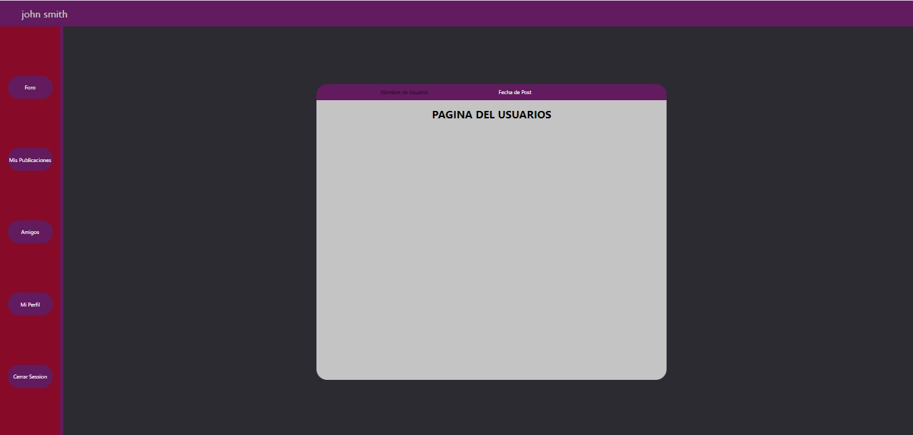
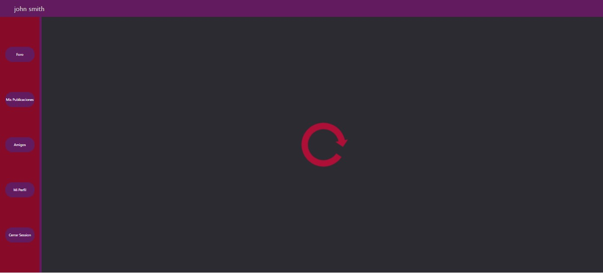
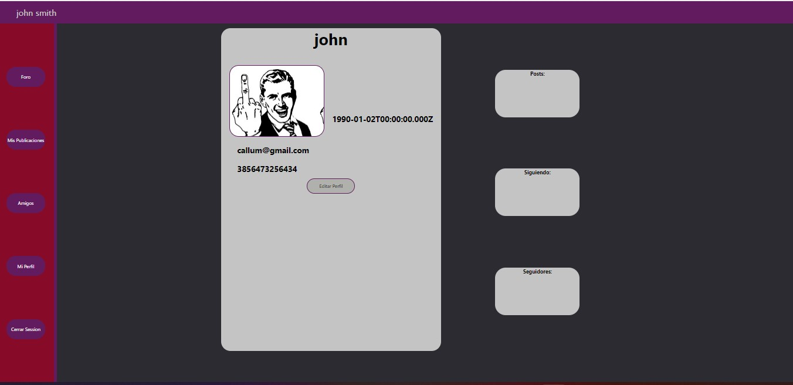
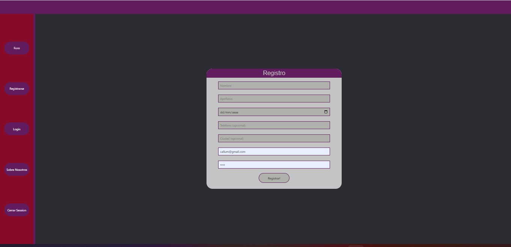

#  Red Social/Foro (proyecto en grupo)  

<div align="center">
    <a href="https://github.com/luigiMinardi/redsocial_frontend/blob/master/LICENSE">
        
    </a>
    
    
    
    
    
    
</div>

------------------------------------------------------
Haga clic [aquí](https://github.com/luigiMinardi/redsocial_frontend.git)para ver el repositorio de este proyecto.

-------------------
# Resumen general del proyecto:

Este es un proyecto realizado íntegramente con HTML, CSS y JS (los paquetes react y redux de node). El objetivo del proyecto era crear una red social/foro totalmente funcional en el front end, que está conectado con el back and api y la base de datos. 

La red social contiene las siguientes funciones:

* Los usuarios pueden inscribirse y crear una cuenta.
* Los usuarios pueden acceder a su página de perfil, donde pueden ver los detalles de su cuenta, así como su historial de publicaciones, a quién siguen y quién les sigue.
* Los usuarios tienen la posibilidad de modificar los datos de su cuenta
* Los usuarios pueden publicar comentarios en la sección del foro
* Los usuarios tienen la posibilidad de dar 'me gusta' a las publicaciones de otras personas, así como de seguirlas y ver su historial de publicaciones


---------------------------------------------------


## Red Social Proyecto Front-End para GeeksHubs Academy.  https://github.com/luigiMinardi/redsocial_frontend.git Un proyecto de front end project hecho con react en node.js. 

***

## La Red Social está diseñada para conectarse con las siguientes Api y Bases de Datos: (https://github.com/luigiMinardi/redsocial_backend.git)


***

Pagina de amigos
***

Mis publicaciones
***


La aplicación tiene las siguientes características:
* Los usuarios pueden conectarse a la aplicación. A continuación, podrán utilizar la funcionalidad adicional del sitio web para comunicarse entre ellos. 
    * Miembros del sitio web:
        * Vea su página de perfil que les da la bienvenida al sitio y resume su actividad.
        * Publicar mensajes en el foro principal.
        * Dar un 'me gusta' a los comentarios escritos por otros usuarios, y tener la capacidad de ver sus perfiles y la actividad en el sitio.

***


..La pagina principal de la red donde la gente postean sus mensajes
***


..Tu pagina de perfil 
***



..La pagina de registro
***


## Pre-requisites of the project to run on your local computer:

* Instalar **Nodejs** en tu ordenador, descargándolo desde su página web oficial
https://nodejs.org/

* Clona el proyecto en tu ordenador con git bash:
```
$git clone 'url-from-repository'
```

* Instale todas las dependencias con el siguiente comando:
```
npm install
```

* Inicie el servidor con el siguiente comando:
```
npm start
```
***

## Tecnologías utilizadas en el proyecto:

* **react**: Instalamos react en nuestro proyecto:
```
npm install react
```
* **react-router-dom**: Instalamos react-router-dom en nuestro proyecto, para poder cambiar de vista en nuestra aplicación:
```
npm install react-router-dom
```
* **axios**: Instalamos axios en nuestro proyecto, para poder consultar la API:
```
npm install axios
```
* ** **redux**: Instalamos redux en nuestro proyecto, para poder usar redux (centralización de estados):
```
npm install redux
```
* **react-redux**: Instalar react-redux en nuestro proyecto (enlaza react y redux):
```
npm install react-redux
```

***


## Explicación de la estructura del proyecto

El directorio **src** es donde se almacena toda la aplicación. En este directorio encontrarás lo siguiente:

* ** **index.js**: Este es el archivo principal. Desde aquí se llama a **<App/>**, que es donde se ejecutará toda la aplicación.

* **app.js**: En este archivo se encuentran los diferentes **Containers** de la aplicación (vistas) se gestionan.

***


* **Redux**: En este directorio almacenamos toda la configuración redux de la aplicación.
    * **store.js**: Este archivo contiene el estado general de la aplicación.
    * **types.js**: Este archivo contiene los nombres de los tipos que pasamos por acción al reductor.
    * **reducers**: Este directorio contiene todos los reductores que modifican el estado:
    * **index.js**: En este archivo combinamos todos los reductores, para lograr la deseada centralización de estados con redux.

***


* **Containers**: Este directorio es donde se almacenarán las diferentes vistas:
    * **Editar Perfil**: En esta vista el usuario puede modificar su perfil.
    * **Hilo**: En esta vista el usuario puede ver los mensajes individuales anteriores.
    * **Posts** En esta vista el usuario puede crear un nuevo mensaje y añadirlo al foro.
    * **Foro**: En esta vista puedes ver el foro principal y todos los mensajes.
    * **Iniciar Session**: En esta vista puedes entrar en tu página de perfil.
    * **Register**: En esta vista puede inscribirse en el servicio creando una cuenta y registrando sus datos en la base de datos.
    * **Seguidores**: En esta vista puedes ver qué otros usuarios te siguen.
    * **Siguiendo**: En esta vista puedes ver una lista de los usuarios a los que sigues.


***

* **Components**: En este directorio se almacenan todos los componentes que se utilizarán en todas las vistas:

    * **Header**: Un borde que aparece en la parte superior en todo momento.
    * **Margin**: Una sección en el lateral que presenta los diferentes enlaces a varias páginas.


-----------------------------------

por Luigi Minardi, Roberto Guzmán y Callum Gordon

---------------------